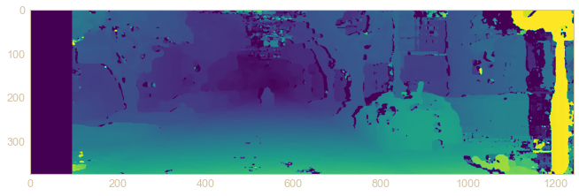

# Kitti Dataset Visualization
Visualize bounding boxes and point cloud map on ROS. And also implements stereo visual odometry based on kitti dataset

## Dataset Visualization
Visualization and manipulation of raw data from multiple sensor of kitti dataset on ros, including video streaming, point cloud from lidar, GPS and IMU.

* Multi-sensor visualization
* Object detection and bounding box.

  

## Stereo Visual Odometry
Using the stereo image captured from the kitti dataset to predict the depth and estimate the pose as odometry.

* Disparity map of stereo vision
* Depth estimation
* Visual odometry and accuracy metric.

  
  

## Reference
* [kitti dataset](https://www.cvlibs.net/datasets/kitti/)
