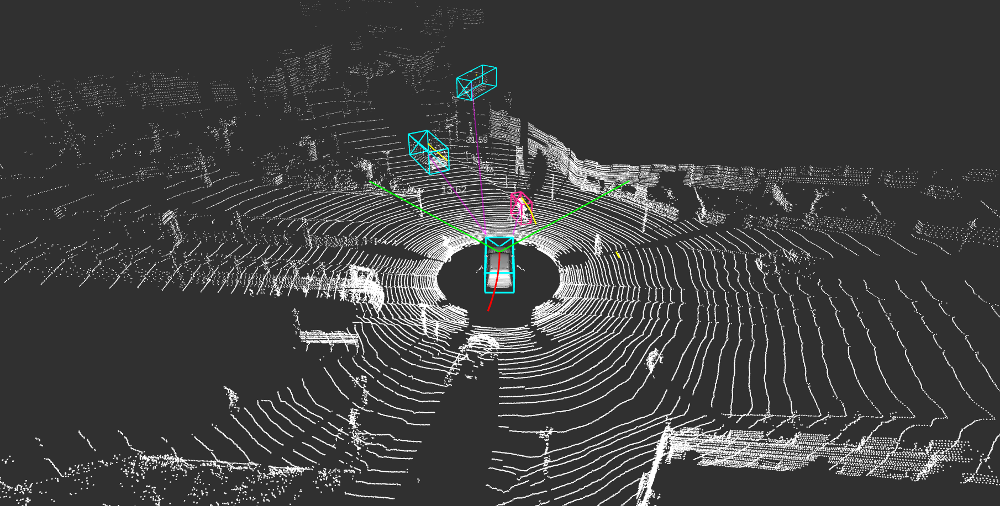
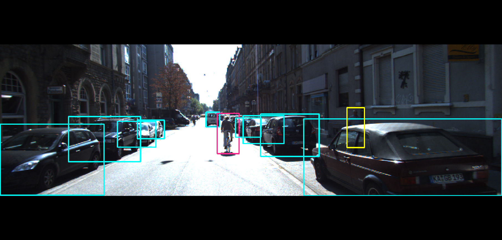
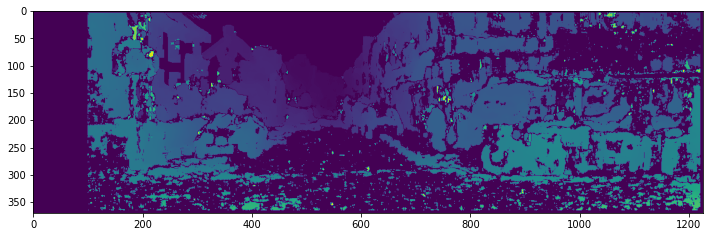
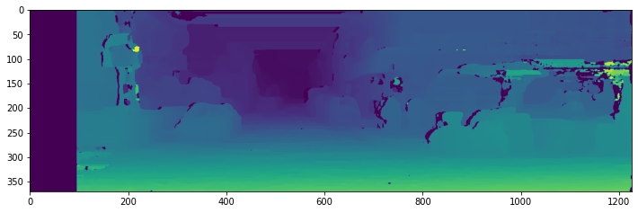
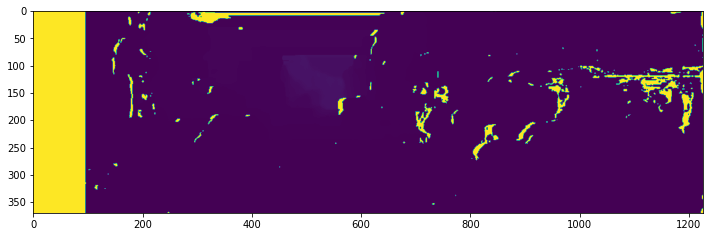

# Kitti Dataset Visualization
Visualize the point cloud map, distances between objects, trajectories, and objects detected bounding boxes on ROS Rviz. And also implement stereo visual odometry with stereo disparity map and stereo depth estimation.

## Dataset Visualization
Visualization and manipulation of raw data from multiple sensors of the KITTI dataset on ROS RViz, including video streaming, point clouds from LiDAR, GPS, and IMU data.

- Multi-sensor visualization
- Object detection and bounding box.

  
  

Please ensure that the dataset of point cloud map and images, and the calibration files are all proper in specific folder. And setup the `rosparam` in the [launch/main.launch](./launch/main.launch).

## Stereo Visual Odometry
Using the stereo image captured from the kitti dataset to predict the depth and estimate the pose as odometry.

* Disparity map of stereo vision
* Depth estimation
* Visual odometry and accuracy metric.

  
  

Matching the disparity map by stereo vision with `BM` and `SGBM` matcher respectively. And based on the disparity map, derived the depth map with intrinsic parameter of left camera.

  

## Reference
* [kitti dataset](https://www.cvlibs.net/datasets/kitti/)
