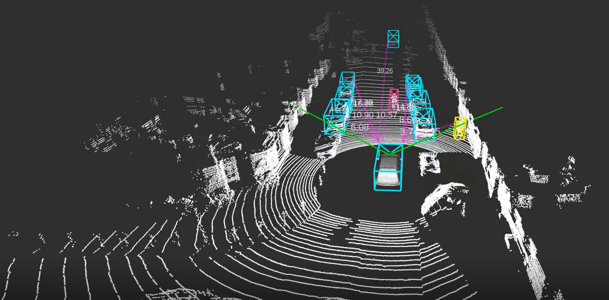
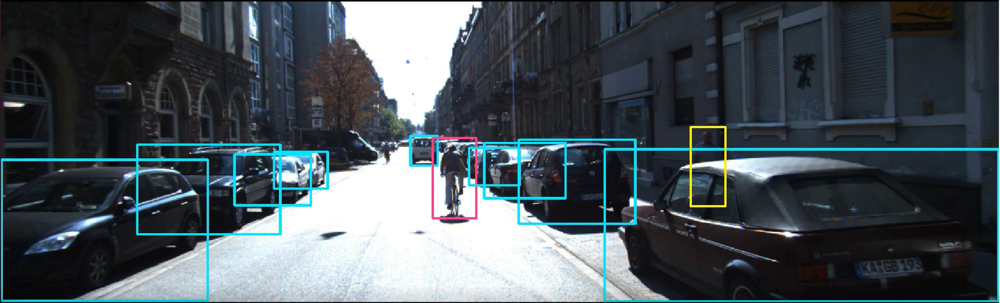
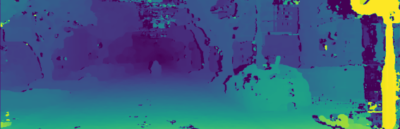
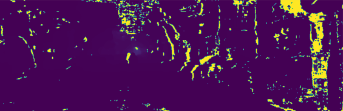

# Kitti Dataset Visualization
Visualize the point cloud map, distance, trajectory, and object bounding boxes with ROS Rviz. And also implements stereo visual odometry with stereo disparity map and stereo depth estimation.

## Dataset Visualization
Visualization and manipulation of raw data from multiple sensors of the KITTI dataset on ROS RViz, including video streaming, point clouds from LiDAR, GPS, and IMU data.
* Multi-sensor visualization
* Object detection and bounding box.

  
  

## Stereo Visual Odometry
Using the stereo image captured from the kitti dataset to predict the depth and estimate the pose as odometry.

* Disparity map of stereo vision
* Depth estimation
* Visual odometry and accuracy metric.

  
  

## Reference
* [kitti dataset](https://www.cvlibs.net/datasets/kitti/)
