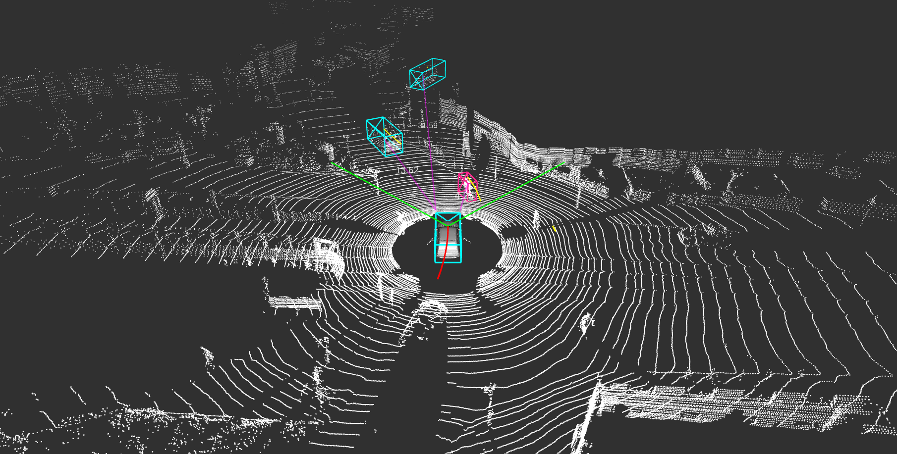
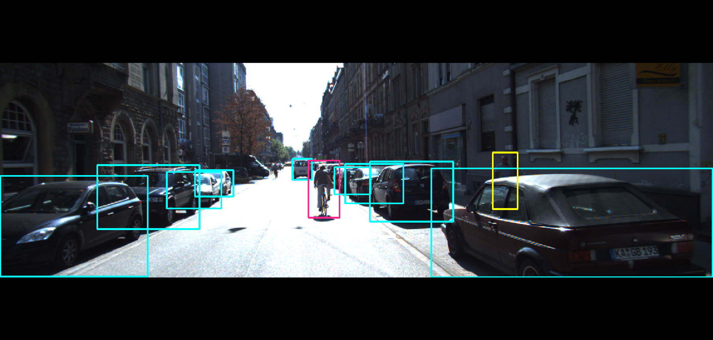
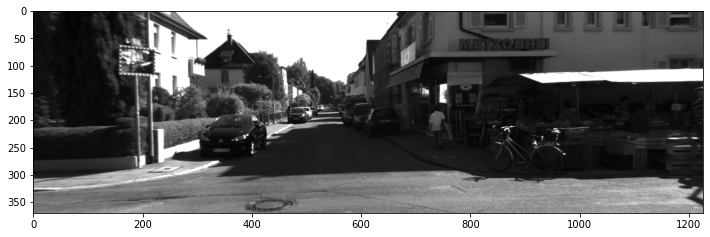
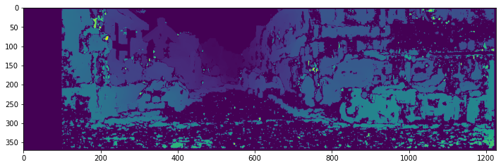
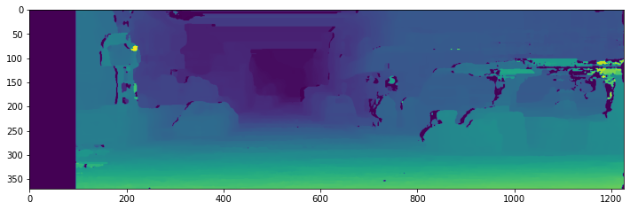
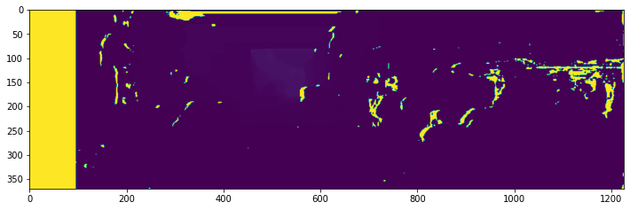
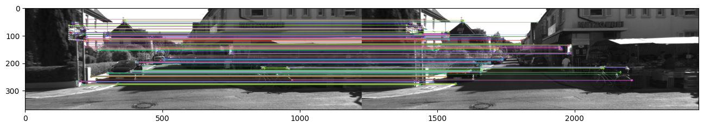
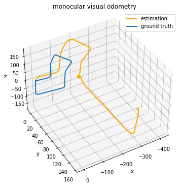
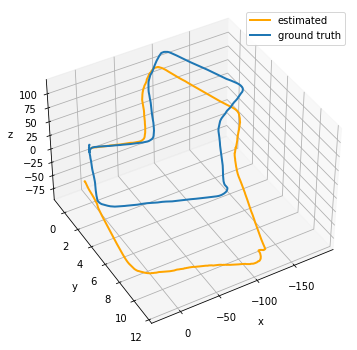
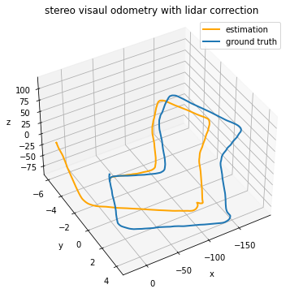

# Kitti Dataset Visualization

`dataset visualize`、`visual odometry`、`stereo depth estimation`

This repository visualizes datasets using a point cloud map, displaying distances between detected objects, trajectories of moving objects, and annotated bounding boxes in `RViz` using `ROS Noetic`. It also implements visual odometry based on stereo depth estimation.

## Dataset Visualization

This section processes raw data from multiple sensors including camera, IMU, GPS, and LiDAR within the dataset. It sets up data collectors and ROS publishers to broadcast the processed data for visualization. The published topics include:

- Multiple Sensor Data
- Annotated Detection Bounding Boxes
- Distances Between Objects and Their Trajectories


<div align="center">
  
  
</div>

Ensure that all required datasets are prepared and that the paths to corresponding files and folders are correctly set in the `.env` file. Adjust the paths according to your setup to ensure proper functionality.

There are three paths you need to be aware of: 

1. `calib_path`: Path to the folder of calibration files (camera and velodyne).
2. `track_path`: Path to the objects annotation file.
3. `value_path`: Path to fhe folder of all sensors data (IMU, GPS, camera, and velodyne).

Once the parameters and dataset are properly set up, you can compile the package using `catkin_make` and launch it with `roslaunch`. This will start the ROS master, the necessary nodes, and RViz in the same terminal.

```shell
roslaunch kitt__dataset_visualize launch/main.launch
```

Before running the command, ensure that your shell can recognize the packages by sourcing the workspace setup file:

```
source devel/setup.bash
```

To avoid having to source this manually every time, you can add the following line to your `~/.bashrc` file.

## Visual Odometry

This section applies stereo images from the KITTI dataset to estimate depth information and applies feature-based visual odometry algorithms to track motion throughout the sequence.

- Disparity Maps from Stereo Vision
- Depth Estimation
- Visual Odometry with Accuracy Metrics

<div align="center">
  
</div>

By using two cameras with known relative positions, we can compute the disparity between corresponding points in the left and right images. This disparity information is then employed to derive depth through triangulation. The disparity map could be generated by stereo vision using the `BM` (Block Matching) or `SGBM` (Semi-Global Block Matching) algorithms.

<div align="center">
  
  
</div>

Once the disparity map is computed, the depth of each pixel can be estimated by applying triangulation: 

$$
Z=\frac{fb}{d}=\frac{fb}{(x_L-x_R)}
$$

Where $d=(x_L-x_r)$ is the disparity matched by algorithms above, $f$ is the focal length of camera, and $b$ is baseline distance between the two cameras.

<div align="center">
  
</div>

To estimate motion between two frames, it is essential to extract and match features between consecutive frames. Various feature detectors, descriptors, and matchers could be utilized to identify corresponding points in the pixel coordinates of consecutive frames, facilitating the computation of motion.

<div align="center">
  
</div>

After obtaining 3D points in camera coordinate by stereo depth estimation, we need to estimate the camera motion by aligning these 3D points with their corresponding 2D observations in the second image.

```math
\textbf p=\begin{bmatrix} u \\v \\1 \\\end{bmatrix} \sim \textbf K(R\textbf P_c+t)
```

This expression forms the foundation of the `Perspective-n-Point (PnP)` problem: given 3D–2D correspondences $(\textbf P_c, \textbf p)$, the goal is to estimate the camera pose, represented by rotation $R$ and translation $t$. In this project, I also include [**notes on motion estimation**](./notebook/README.md) between two image frames. To solve the PnP problem, the `cv2.solvePnPRansac` function is used. This method incorporates **RANSAC (Random Sample Consensus)** to enhance robustness by iteratively selecting random subsets of correspondences, estimating the transformation, and rejecting outliers.

<div align="center">
  
  
</div>

In the test above, we observe that stereo depth estimation helps mitigate the scale ambiguity and drift issues commonly encountered in monocular visual odometry. I also try to incorporate `LiDAR` point clouds to refine the depth information obtained from stereo vision, aiming to enhance the performance of visual odometry: 

<div align="center">
  
</div>


