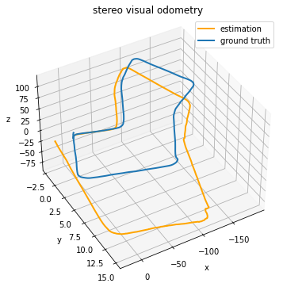

# Kitti Dataset Visualization

This repository visualizes the dataset using a point cloud map, the distances between detected objects, the trajectories of moving objects, and annotated bounding boxes in RViz with ROS noetic. It also implements visual odometry using stereo depth estimation.


## Dataset Visualization

This section processes raw data from multiple sensors, including a camera, IMU, GPS, and LiDAR, from the dataset. It creates collectors and publishers in ROS to publish the processed data using visualization tools. The published topics include:

- Multiple Sensors
- Annotated Detection Bounding Boxes
- Distances Between Objects and Their Trajectories


<div align="center">
  
  
</div>

Please ensure that all required datasets are prepared and that the paths to the corresponding files and folders are correctly set in the `rosparam` file located at [launch/main.launch](./launch/main.launch). Alternatively, you can set the default path directly in the main function using:

```python
rospy.get_param('param_name', 'default path of file of folder')
```

There are three paths you need to be aware of: 

1. `calib_path`: Stores the file for camera and Velodyne calibrations.
2. `track_path`: The file containing annotated objects tracked in each frame.
3. `value_path`: Stores the path to the folder containing all sensor data, such as images, Velodyne points, and OXTS data.

Once the parameters and dataset are properly set up, you can compile the package using `catkin_make` and launch it with `roslaunch`. This will start the ROS master, the necessary nodes, and RViz in the same terminal.

```shell
roslaunch kitt__dataset_visualize launch/main.launch
```

Before running the command, ensure that your shell can recognize the packages by sourcing the workspace setup file:

```
source devel/setup.bash
```

To avoid having to source this manually every time, you can add the following line to your `.bashrc` file

## Visual Odometry

This section utilizes stereo images captured from the KITTI dataset to predict depth information and applies feature-based visual odometry algorithms to estimate the motion throughout the sequence.

* Disparity Map of Stereo Vision
* Depth Estimation
* Visual Odometry and Accuracy Metrics

<div align="center">
  
</div>

By using two cameras with known relative positions, we can compute the disparity between corresponding points in the left and right images. This disparity information is then employed to derive depth through triangulation. The disparity map could be generated by stereo vision using the `BM` (Block Matching) or `SGBM` (Semi-Global Block Matching) algorithms.

<div align="center">
  
  
</div>

Once the disparity map is computed, the depth of each pixel can be estimated by applying triangulation: 

$$
Z=\frac{fb}{d}=\frac{fb}{(x_L-x_R)}
$$

Where $d=(x_L-x_r)$ is the disparity matched by algorithms above, $f$ is the focal length of camera, and $b$ is baseline distance between the two cameras.

<div align="center">
  
</div>

To estimate motion between two frames, it is essential to extract and match features between consecutive frames. Various feature detectors, descriptors, and matchers could be utilized to identify corresponding points in the pixel coordinates of consecutive frames, facilitating the computation of motion.

<div align="center">
  
</div>

After obtaining 3D points in camera coordinate by stereo depth estimation, we need to estimate the camera motion by aligning these 3D points with their corresponding 2D observations in the second image.

$$
\mathbf p'=\begin{bmatrix}u'\\ v'\\ 1 \end{bmatrix}\sim \mathbf K(R\mathbf P_c+t)
$$

This equation forms the basis of the `PnP` problem: given 3D-2D correspondences $(\mathbf P_c, \mathbf p')$ 
, and estimate $R$ and $t$. The `cv2.solvePnPRansac` function solves this problem by minimizing the reprojection error, which measures how well the projected 3D points align with the observed 2D keypoints:

$$
\sum_i||\mathbf p_i'-\pi(R\mathbf P_{c_i}-t)||^2
$$

Where $\pi(\cdot)$ is the projection function. **RANSAC (Random Sample Consensus)** is applied to improve robustness by iteratively selecting random subsets of correspondences, solving transformation and discarding outliers.

<div align="center">
  
  
</div>

In the test above, we observe that stereo depth estimation helps mitigate the scale ambiguity and drift issues commonly encountered in monocular visual odometry. I also try to incorporate `LiDAR` point clouds to refine the depth information obtained from stereo vision, aiming to enhance the performance of visual odometry: 

<div align="center">
  
</div>


