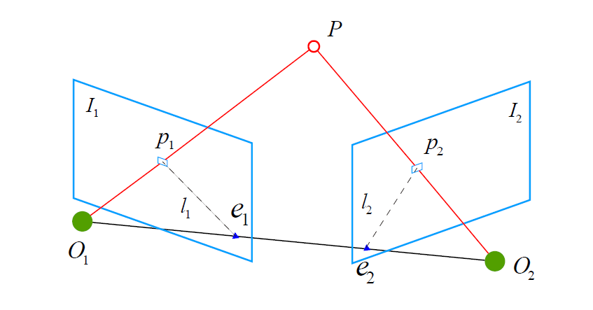
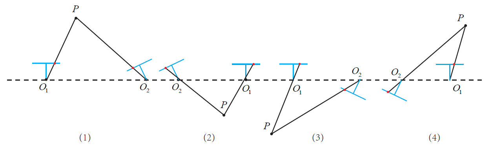

# Motion Estimation

Once we have matched feature pairs between two frames, we can estimate the motion between them based on these correspondences. Depending on the type of camera used, the approach to motion estimation differs:

1. **Monocular Camera**: Since depth cannot be obtained directly from a single frame, we estimate motion using 2D feature correspondences between the two frames by `Epipolar Geometry`.

2. **Known 3D Landmarks (3D-2D Correspondences)**:  If the 3D coordinates of landmarks are known and their corresponding 2D pixel coordinates are available, we can solve the motion estimation problem using the `Perspective-n-Point (PnP)` algorithm.

3. **Stereo or RGB-D camera**: Depth information can be directly obtained from each frame, allowing us to estimate motion using `Iterative Closest Point (ICP)`. But we are not going to discuss this approach in this project.

In the following sections, we focus on discussing the [**Epipolar Geometry**](#2d-2d-epipolar-geometry) and the [**Perspective-n-Point (PnP)**](#3d-2d-perspective-n-points-pnp-problems) algorithm.

## 2D-2D: Epipolar Geometry

To estimate the motion between two image frames $I_1$ and $I_2$, we define the transformation from the first frame to the second as a rotation $R$ and a translation $t$. Now, consider a feature point $p_1$ in $I_1$, which corresponds to a matched pointt $p_2$ in $I_2$. These correspondences are obtained through feature matching. If the match is correct, it indicates that $p_1$ and $p_2$ are projections of the same 3D point onto the two image planes.

The three points $O_1,O_2$ and $P$ define a plane known as the `epipolar plane`. The points $e_1$ and $e_2$, which are the projections of one camera center onto the other camera’s image plane, are called `epipoles`. The line segment $O_1O_2$ connecting the two camera centers is referred to as the `baseline` (notes that the translation $t$ between two image frames also lay on baseline). And the intersections of the epipolar plane with the two image planes form the `epipolar lines`, denoted as $l_1$ and $l_2$.

<div align="center" >
    
</div>

We know that the normal vector of the epipolar plane must be orthogonal to $p2$, thus we could assume that:

```math
\bold x_2\cdot(t\times \bold x_2)=0
```

Let’s expand the constraint in matrix form and represent the cross product using a `skew-symmetric matrix`.

```math
\begin{pmatrix}x_2&y_2&z_2 \end{pmatrix}\begin{pmatrix}0&-t_z&t_y\\ t_z&0&-t_x\\-t_y&t_x&0 \end{pmatrix}\begin{pmatrix} x_2\\ y_2\\ z_2\end{pmatrix}=0
```

Remember that the transformation between two image frames: $p_2=Rp_1+t$, and write it in matrix form will be like:

```math
\begin{pmatrix}x_2\\ y_2 \\ z_2 \end{pmatrix}=\begin{pmatrix} r_{11}&r_{12}&r_{13}\\r_{21}&r_{22}&r_{23}\\r_{31}&r_{32}&r_{33}\end{pmatrix}\begin{pmatrix}x_1 \\ y_1 \\z_1 \end{pmatrix}+\begin{pmatrix} t_x\\ t_y\\ t_z\end{pmatrix}
```

so we can now combine two equation, and replace a $p2$ in constraint with transformation relation.

```math
\begin{pmatrix}x_2 &y_2&z_2 \end{pmatrix}\begin{pmatrix}0&-t_z&t_y\\t_z&0&-t_x\\-t_y&t_x&0 \end{pmatrix}\begin{pmatrix} r_{11}&r_{12}&r_{13}\\r_{21}&r_{22}&r_{23}\\r_{31}&r_{32}&r_{33}\end{pmatrix}\begin{pmatrix}x_1 \\ y_1 \\ z_1 \end{pmatrix}=0
```

in matrix form: 

```math
\bold x_2^\top t^\wedge R \bold x_1= \bold x_2^\top E \bold x_1=0
```

We call $E$ the `essential matrix`, which is defined as the product of the translation vector in skew-symmetric matrix form and the rotation matrix. In later sections, we will use matched point pairs to estimate the essential matrix and then decompose it back into the translation vector and rotation matrix. This allows us to recover the relative motion between the two frames.

Note that $\bold x_1$ and $\bold x_2$ represent the 3D positions (or projective vector) of a scene point with respect to the left and right camera coordinate frames, respectively. In addition, we also know the 2D image coordinates of the corresponding points in both views:

```math
\bold p \simeq z\bold p = K\bold x \rightarrow \bold x=K^{-1}p
```

So we can rewrite epipolar constraint:

```math
\bold x_2^\top E\bold x_1=\bold p_2^\top K^{-\top}EK^{-1}\bold p_1=\bold p_2^\top F\bold p_1=0
```

Here, we refer to $F$ as the `fundamental matrix`. The main difference between the `essential matrix` $E$ and the `fundamental matrix` $F$ lies in the presence of the camera intrinsic parameters. While the essential matrix operates in normalized camera coordinates, the fundamental matrix relates pixel coordinates and incorporates the `intrinsic calibration matrices` $K$.

### 8-points Algorithm
Now, we are going to derive the essential matrix from given matched features between two image frames. Consider a pair of corresponding points expressed in homogeneous coordinates. According to the epipolar constraint:

```math
\begin{bmatrix}u_2&v_2&1 \end{bmatrix}\begin{bmatrix}e_1&e_2&e_3\\
e_4&e_5&e_6\\
e_7&e_8&e_9 \end{bmatrix}\begin{bmatrix}u_1\\v_1\\1 \end{bmatrix}=0
```

And we can expand the essential matrix constraint into a vector form:

```math
e=\begin{bmatrix}e_1&e_2&e_3&e_4&e_5&e_6&e_7&e_8&e_9 \end{bmatrix}^\top
```

Thus, the epipolar constraint can be expressed as a linear equation in terms of the elements of the essential matrix.

```math
\begin{bmatrix}u_1u_2&u_2v_1&u_2&v_2u_1&v_1v_2&v_2&u_1&v_1&1 \end{bmatrix}\cdot e=0
```

Since we can obtain many point pairs through the feature detection and matching process, we can incorporate them into a system of linear equations based on the epipolar constraint.

```math
\begin{pmatrix}
u^1_1u^1_2&u^1_2v^1_1&u^1_2&v^1_2u^1_1&v^1_1v^1_2&v^1_2&u^1_1&v^1_1&1 \\ 
u^2_1u^2_2&u^2_2v^2_1&u^2_2&v^2_2u^2_1&v^2_1v^2_2&v^2_2&u^2_1&v^2_1&1 \\
\vdots&\vdots&\vdots&\vdots&\vdots&\vdots&\vdots&\vdots&\vdots \\
u^i_1u^i_2&u^i_2v^i_1&u^i_2&v^i_2u^i_1&v^i_1v^i_2&v^i_2&u^i_1&v^i_1&1 
\end{pmatrix} \cdot 
\begin{pmatrix}e_1 \\ e_2 \\ e_3 \\ e_4 \\ e_5 \\ e_6\\\ e_7 \\ e_8 \\ e_9 \end{pmatrix}=0
```

To solve this equation for a non-trivial solution, we need at least 8 point correspondences. This ensures that the coefficient matrix has rank 8, so its null space is one-dimensional, allowing us to recover the solution vector $e$, which corresponds to the essential matrix $E$. This aligns with the fact that the essential matrix is defined **up to scale**. By applying the `8-point algorithm`, we can estimate the essential matrix $E$ from the matched feature points.

In practice, however, we often obtain more than 8 matched pairs through feature detection and matching. This leads to an overdetermined system, for which an exact solution $e$ may not exist. To address this, we solve the system using **least squares minimization**, finding the vector $e$ that best satisfies the epipolar constraint in the least-squares sense.

```math
\min_e\| Ae\|^2_2=\min_ee^\top A^\top Ae
```

However, since the matches are often affected by noise and outliers, we typically use **Random Sample Consensus (RANSAC)** instead of a simple least squares approach in practice.

### Decompose Essential Matrix
Given $t^\wedge$ is a skew-symmetric matrix, and $R$ is an orthonormal matrix, it’s possible to decouple $t^\wedge$ and $R$ from essential matrix $E$ through `singular value decomposition`. 

```math
E=U\Sigma V^\top
```

The essential matrix $E$ has **two equal non-zero singular values** and one zero singular value like $(\sigma, \sigma, 0)$.Because $E$ is defined only up to scale, we may, without loss of generality, normalize these singular values to $(1, 1, 0)$. Strictly speaking, the singular values are $(\|t \|, \|t\|, 0)$, where $t$ is the translation vector, but in epipolar geometry the scale of $t$ is ambiguous, so we customarily set $\|t\|=1$. We will not prove this property here, but it can be derived by examining the structure $E^\top E$ and observe the eigenvalues of $t^{\wedge \top}t^\wedge$ matrix

```math
E^\top E=(t^\wedge R)^\top(t^\wedge R)=R^\top t^{\wedge\top}t^\wedge R
```

we can have a singular value decomposition of essential matrix

```math
E =U\begin{bmatrix} 1 & 0 & 0 \\ 0 & 1 & 0 \\ 0&0&0\end{bmatrix}V^\top=t^\wedge R
```

we can also decompose $\Sigma $ matrix as: 

```math
\Sigma=\begin{bmatrix} 1 & 0 & 0 \\ 0 & 1 & 0 \\ 0&0&0\end{bmatrix}=\begin{bmatrix} 0 & 1 & 0 \\ -1 & 0 & 0 \\ 0&0&0\end{bmatrix}\begin{bmatrix} 0 & -1& 0 \\ 1 & 0 & 0 \\ 0&0&1\end{bmatrix}
```

In fact, we can observe that the first matrix in this product represents a skew-symmetric matrix corresponding to the cross product with the `unit Z-axis vector`. This matrix maps any vector parallel to the Z-axis to zero, and rotates vectors in the XY-plane counterclockwise by 90 degrees.

It is precisely this **rotation property in the XY-plane** that leads to the introduction of the matrix $W$ in the decomposition of the essential matrix. The matrices $W$ and $W^\top$ help reconcile the structural differences between the SVD bases $(U, \Sigma, V)$ and the desired **rotation and translation** components. More precisely, they embody the **singular value structure $(\sigma, \sigma, 0)$** of the essential matrix and serve as the **minimal rotational factors** needed to align the SVD components with physically meaningful motion parameters—namely, the translation direction and rotation matrix.

```math
E=U\begin{bmatrix} 1 & 0 & 0 \\ 0 & 1 & 0 \\ 0&0&0\end{bmatrix}V^\top=U\begin{bmatrix} 0 & 1 & 0 \\ -1 & 0 & 0 \\ 0&0&0\end{bmatrix}\begin{bmatrix} 0 & -1& 0 \\ 1 & 0 & 0 \\ 0&0&1\end{bmatrix}V^\top \\=U\begin{bmatrix} 0 & 1 & 0 \\ -1 & 0 & 0 \\ 0&0&0\end{bmatrix}U^\top U\begin{bmatrix} 0 & -1& 0 \\ 1 & 0 & 0 \\ 0&0&1\end{bmatrix}V^\top
```

Now, we are ready to decompose the essential matrix. (Notes that the translation vector is given by the **third column** of the matrix $U$ if normalized)

```math
t_1^\wedge = U\begin{bmatrix} 0 & 1 & 0 \\ -1 & 0 & 0 \\ 0&0&0\end{bmatrix}U^\top=\Big( U\begin{bmatrix}0 \\  0 \\ 1 \end{bmatrix}\Big)^\wedge \rightarrow t_1=U \begin{bmatrix}0 \\  0 \\ 1 \end{bmatrix}=u^\top

\\

R_1=U\begin{bmatrix} 0 & -1& 0 \\ 1 & 0 & 0 \\ 0&0&1\end{bmatrix}V^\top \triangleq UWV^\top
```

Similarly, since the matrix $\Sigma$ also allows for an alternative decomposition:

```math
\Sigma=\begin{bmatrix} 1 & 0 & 0 \\ 0 & 1 & 0 \\ 0&0&0\end{bmatrix}=\begin{bmatrix} 0 & -1 & 0 \\ 1 & 0 & 0 \\ 0&0&0\end{bmatrix}\begin{bmatrix} 0 & 1& 0 \\ -1 & 0 & 0 \\ 0&0&1\end{bmatrix}
```

So we have $t_1, t_2$ and $R_1, R_2$. We can illustrate the four possible solutions resulting from the decomposition of the essential matrix. Fortunately, only one of these solutions yields a configuration in which the 3D point has `positive depth` in both camera coordinate systems. Therefore, by `triangulating` any matched point pair under each of the four possible solutions and checking whether the reconstructed 3D point lies in front of both cameras, we can uniquely determine the correct camera pose.

<div align="center">
    
</div>

In practice, after performing **Singular Value Decomposition** on the essential matrix, the resulting singular values may not be exactly $(\sigma, \sigma,0)$; instead, they might appear as $(\sigma_1, \sigma_2,\sigma_3)$ where $\sigma_1\geq \sigma_2\geq\sigma_3$. To enforce the ideal structure of the essential matrix, we can correct the singular values as follows:

```math
E=U\text{diag}\Big(\frac{\sigma_1+\sigma_2}{2}, \frac{\sigma_1+\sigma_2}{2}, 0\Big)V^\top
```

Of course, a simpler and commonly used approach is to directly set the singular values to $(1, 1, 0)$, since the essential matrix is defined **up to scale**.

### Homography
Besides the essential matrix $E$ and the fundamental matrix $F$, another widely used matrix is the homography matrix $H$. When all feature points lie on a single plane, the homography matrix can be used to estimate the camera motion. It is typically computed using the `Direct Linear Transform (DLT)` algorithm, and then decomposed into a rotation matrix and translation vector using either numerical or analytical methods.

```math
p_1\simeq Hp_2
```

Homography plays a critical role in SLAM applications, especially in cases where the scene is planar or the camera undergoes pure rotational motion. In such scenarios, the essential matrix becomes **degenerate**, meaning its degrees of freedom are reduced. If we still apply the standard 8-point algorithm to solve for the essential matrix in this degenerate case, the result may become dominated by noise. To handle this in practice, we estimate both the essential matrix and the homography matrix, and select the one with the smaller reprojection error, thereby improving robustness against degenerate conditions and noise.

### Monocular Initialization
Because the essential matrix is defined up to scale, the translation vector $t$ recovered from its decomposition inherits this scale ambiguity, whereas the rotation matrix does not. Multiplying $t$ by any non‑zero scalar still produces a valid decomposition, yet its true length remains unknown. To handle this, we usually normalize $t$ to unit length. In monocular case, this normalization fixes an arbitrary scale; all 3D landmarks are then expressed in that unit. This step is known as `monocular initialization`.

Besides, if the camera motion during initialization is pure rotation($t=0$), the essential matrix collapses to zero, making it impossible to recover $R$ from the epipolar constraint. Although $R$ can still be estimated via a homography, the absence of translation prevents triangulation of feature points, so no 3D structure can be initialized. Therefore, monocular initialization is impossible without some translational motion.

## 3D-2D: Perspective-n-Points (PnP) Problems
**Perspective-n-Point (PnP)** is a method used to estimate camera motion from known 3D points and their corresponding 2D image projections. The 3D coordinates of the points can be obtained through triangulation, depth estimation, or other sensors. Therefore, PnP is commonly used in **stereo** or **RGB-D** visual odometry. For **monocular** systems, however, an initialization step is required to obtain scale information.

There are various algorithms for solving the PnP problem, including **P3P** (which estimates pose from 3 points and verifies with a 4th), **Efficient PnP (EPnP)**, and the **Direct Linear Transform (DLT)**. In addition, **nonlinear optimization** techniques can be applied by formulating the problem as a **least squares minimization**, and then solved it iteratively.

### Direct Linear Transform (DLT)

Consider a 3D point $P=(X,Y,Z,1)^\top$ (represented in homogeneous coordinates) in space. In image frame, this point projects onto a feature point $p=(u, v, 1)^\top$, expressed in normalized image plane coordinates. At this stage, the camera pose, which represented by rotation $R$ and translation $t$ is unknown. We define the `augmented projection matrix`, which encapsulates the rotation, translation, and camera intrinsic parameters. 

```math
M=K \begin{bmatrix}R & t \end{bmatrix} \in \mathbb R^{3 \times 4}
```

We derive the relationship between the 3D point $P$ and its corresponding feature point in pixel coordinates by expressing the projection matrix $M$ in terms of its row vectors and eliminating the scale factor $s$ from the homogeneous projection equation.

```math
s\begin{bmatrix}u \\ v\\ 1 \end{bmatrix}=M\begin{bmatrix}X\\ Y\\ Z\\1 \end{bmatrix}=\begin{bmatrix}m_1^\top\\ m_2^\top \\m_3^\top \end{bmatrix}\begin{bmatrix}X\\ Y\\ Z\\1 \end{bmatrix} =\begin{bmatrix}m_1^\top\\ m_2^\top \\m_3^\top \end{bmatrix}P
```

```math
u=\frac{su}{s}=\frac{m_1^\top\cdot P}{m_3^\top \cdot P}\\ v=\frac{sv}{s}=\frac{m_2^\top\cdot P}{m_3^\top \cdot P}
```

Now that we have obtained two constraints, we can organize them into a **homogeneous system of equations**. This formulation is beneficial for analyzing the system’s properties and facilitates the subsequent solution process.

```math
(m_1^\top-um^\top_3)\cdot P=0, 
(m_2^\top-vm^\top_{3})\cdot P=0
```

For $n$ correspondences $(P_i, p_i)$ , we can stack all the equations into a large matrix $Q$
```math
\begin{bmatrix}
P_1^\top&0^\top&-u_1P_1^\top\\
0^\top&P_1^\top&-v_1P_1^\top \\
\vdots & \vdots & \vdots \\
P_n^\top&0^\top&-u_nP_n^\top\\
0^\top&P_n^\top&-v_nP_n^\top \\
\end{bmatrix} \begin{bmatrix} m_1\\m_2\\m_3 \end{bmatrix} = Q\cdot M=\bold 0
```

Here $Q$ is known (it could be computed by known correspondences). $M$ is unknown and composed with intrinsic and extrinsic matrix, we are going to obtain it through solving the linear equation. 

```math
\text{rank}(Q)+\text{null}(Q)=\dim(Q)=12
```

By analyzing the linear system, we observe that if $\text{rank}(Q)=11$, then the projection matrix $M$ has a **unique non-zero solution**. Since each point correspondence provides two independent equations, we require $2n=11$, which implies 5.5 point correspondences. In practice, we need `at least 6 points` to determine $M$.

Once $M$ is determined, we can recover the intrinsic and extrinsic parameters of the camera. This can be done using `RQ decomposition`, which factorizes the projection matrix 
$M$ into an upper triangular matrix $K$ (containing the intrinsic parameters), and a rotation matrix $R$ , along with a translation vector $t$.

### Bundle Adjustment
(This section requires some prerequisites in Lie algebra and nonlinear optimization)

In addition to using linear methods, the PnP problem can also be formulated as a **nonlinear least squares problem** defined on `Lie algebra`. As mentioned earlier, linear methods such as the `Direct Linear Transform (DLT)` or `P3P` typically estimate the camera pose first, and then recover the 3D point positions separately. In contrast, nonlinear optimization treats both the camera pose and the 3D points as joint optimization variables, solving them simultaneously. This is a highly general and powerful approach, and it can also be applied to refine the results of other problems such as `ICP (Iterative Closest Point)`.

According to the camera model, the relationship between pixel coordinates and 3D point positions is given as follows (notes that implicit conversion involves from homogeneous to non-homogeneous coordinates):

```math
s_i\begin{bmatrix}u_i\\v_i\\1 \end{bmatrix}=K\exp(\xi^\wedge)\begin{bmatrix}X_i\\Y_i\\Z_i\\1 \end{bmatrix}\rightarrow s_ip_i=K\exp(\xi^\wedge)P_i
```

Due to the unknown camera pose and the presence of noise in the observed feature points, the projection equation cannot be satisfied exactly, there will be some error. Therefore, we formulate a least squares problem by summing the individual errors and seek the optimal camera pose that minimizes this error. In the context of PnP, this process is often referred to as a form of `Bundle Adjustment`, where the goal is to minimize the `reprojection error` between the observed 2D image points and the projected 3D points.

```math
\xi^*=\argmin_\xi\frac{1}2\sum_{i=1}^n \Big\|p_i-\frac{1}s_iK\exp(\xi^\wedge)P_i \Big\|^2_2
```

By leveraging Lie algebra, we can formulate an unconstrained optimization problem, which can be efficiently solved using optimization algorithms such as `gradient descent`, `Gauss-Newton`, or the `Levenberg–Marquardt method`. A critical aspect of this optimization process is the computation of the derivative (Jacobian) of each error term with respect to the optimization variables. While numerical differentiation is always an option, deriving the analytical form of the Jacobian offers several key advantages like higher accuracy, and improved convergence.

We begin by considering the transformation of a 3D point $P$ from the world coordinate system to the camera coordinate system, resulting in a new point $P'$. By taking the **first three components** of the transformed point, we can convert its homogeneous coordinates into non-homogeneous coordinates.

```math
P^\prime=\Big(\exp(\xi^\wedge)P \Big)_{1:3}=(X',Y',Z')^\top
```

Therefore, the camera projection model with respect to $P'$ is given by

```math
s_ip_i=KP_i^\prime
```

By `left-multiplying the perturbation` $\delta \xi$ onto $\xi^\wedge$, and analyzing how the error term $e$ changes with respect to this perturbation, we can apply the chain rule to obtain:

```math
\frac{\partial e}{\partial \delta \xi}=\lim_{\delta\xi\rightarrow 0}\frac{e(\delta \xi\oplus \xi)}{\delta \xi}=\frac{\partial e}{\partial P^\prime}\frac{\partial P^\prime}{\partial \delta\xi}
```

The first term is the derivative of the reprojection error (in pixel coordinates) with respect to the projected 3D point in the camera coordinate system. This can be directly obtained from the camera projection model, which defines the relationship between pixel coordinates, camera coordinates, and the intrinsic matrix.

```math
\frac{\partial e}{\partial P^\prime}=-\begin{bmatrix} \frac{f_x}{Z'} & 0 & -\frac{f_xX'}{Z'^2} \\
0 & \frac{f_y}{Z'} & -\frac{f_yY'}{Z'^2} \end{bmatrix}
```

The second term is the derivative of the transformed 3D point with respect to the Lie algebra perturbation. Since the 3D point is represented in homogeneous form after transformation, we take only the first three components for differentiation.

```math
\frac{\partial (TP)}{\partial \delta \xi}=(TP)^\odot =\begin{bmatrix}I&-P'^\wedge\\0&0 \end{bmatrix} \rightarrow \frac{\partial P'}{\partial \delta \xi}=\begin{bmatrix} I & -P'^\wedge \end{bmatrix}
```

By multiplying these two terms, we obtain a $2\times 6$ `Jacobian matrix` $\mathcal J$, which maps the six degrees of freedom of the camera pose to the two-dimensional reprojection error in the pixel coordinate space.

```math
J=\frac{\partial e}{\partial \delta \xi}=-\begin{bmatrix}\frac{f_x}{Z'} & 0 & -\frac{f_xX'}{Z'^2} & -\frac{f_xX'Y'}{Z'^2} & f_x+\frac{f_xX'^2}{Z'^2} & -\frac{f_xY'}{Z'} \\
0 & \frac{f_y}{Z'} & -\frac{f_yY'}{Z'^2} & -f_y-\frac{f_yY'^2}{Z'^2} & \frac{f_yX'Y'}{Z'^2} & \frac{f_yX'}{Z'} \end{bmatrix}
```

This Jacobian matrix describes the first-order relationship between the reprojection error and the camera pose, represented in Lie algebra. On the other hand, in addition to optimizing the camera pose, we also aim to optimize the 3D positions of the feature points. Therefore, it is necessary to analyze the derivative of the reprojection error $e$ with respect to the 3D point $P$

```math
\frac{\partial e}{\partial P}=\frac{\partial e}{\partial P'}\frac{\partial P'}{\partial P}
```

As a result, we have derived two Jacobian matrices: one with respect to the camera pose and one with respect to the 3D point position. These matrices provide crucial **gradient information** during the optimization process, guiding the iterative updates toward convergence.
